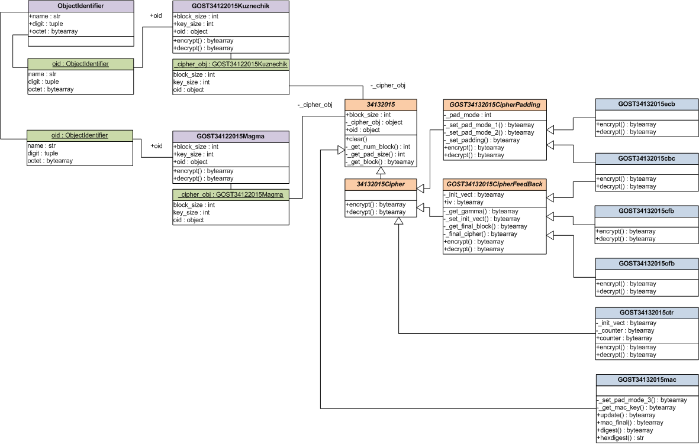
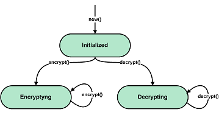

API of the 'gostcrypto.gostcipher' module
=========================================

Introduction
""""""""""""

The module implements the modes of operation of block encryption algorithms "magma" and "kuznechik", described in GOST 34.13-2015. This document defines several encryption modes using block ciphers (ECB, CBC, CFB, OFB and CTR) and a message authentication code generation mode (MAC).

The module includes:

- ``GOST34122015Kuznechik``: Class that implements the 'kuznechik' block encryption algorithm.
- ``GOST34122015Magma``: Class that implements the 'magma' block encryption algorithm.
- ``GOST3413205``: Base class of the cipher object.
- ``GOST3413205Cipher``: Base class of the cipher object for implementing encryption modes.
- ``GOST3413205CipherPadding``: Base class of the cipher object for implementing encryption modes with padding.
- ``GOST3413205CipherFeedBack``: Base class of the cipher object for implementing encryption modes with feedback. 
- ``GOST3413205ecb``: Class that implements ECB mode of block encryption.
- ``GOST3413205cbc``: Class that implements CBC mode of block encryption.
- ``GOST3413205cfb``: Class that implements CFB mode of block encryption.
- ``GOST3413205ofb``: Class that implements OFB mode of block encryption.
- ``GOST3413205ctr``: Class that implements CTR mode of block encryption.
- ``GOST34132015mac``: Class that implements MAC mode.
- ``GOSTCipherError``: The exception class.
- ``new``: Function that creates a new encryption object and returns it.

    Class hierarchy of the **gostcipher** module

.. note::
    You can encrypting only **byte strings** or **byte arrays** (for example ``b'cipher_text'`` or ``bytearray([0x68, 0x61, 0x73, 0x68, 0x5f, 0x74, 0x65, 0x78, 0x74])``).

API principles
""""""""""""""

The cipher mode (ECB, CBC, CFB, OFB and CTR)
''''''''''''''''''''''''''''''''''''''''''''

    General state diagram for the cipher object for ECB, CBC, CFB, OFB, and CTR modes

You create an instance of the cipher object by calling the ``new()`` function. The first parameter is the name of the algorithm (``'kuznechik'`` or ``'magma'``), the second parameter is always the cryptographic key, and the third is the encryption mode. You can (and sometimes should) pass additional cipher or mode parameters to ``new()`` (for example, the initialization vector value or padding mode).

To encrypt data, you call the cipher object's ``encrypt()`` method with plaintext as an input parameter. The method returns a fragment of ciphertext.

To decrypt data, you call the cipher object's ``decrypt()`` method with cipher textas an input parameter. The method returns a fragment of plaintext.

The message authentication code algorithm (MAC)
'''''''''''''''''''''''''''''''''''''''''''''''

    General state diagram for the cipher object for MAC mode

The first message fragment for the MAC calculation can be passed to the ``new()`` function as the keyword argument ``data``. This argument is optional for the ``new`` function. If necessary, the first fragment of the message can be passed to the ``update()`` method (in this case, the message is not passed to the ``new`` function).

.. rubric:: Passing the first message fragment to the ``new()`` function and calling the ``update()`` method with the second message fragment:

.. code-block:: python

    import gostcrypto
	
    key = bytearray([
        0x88, 0x99, 0xaa, 0xbb, 0xcc, 0xdd, 0xee, 0xff, 0x00, 0x11, 0x22, 0x33, 0x44, 0x55, 0x66, 0x77,
        0xfe, 0xdc, 0xba, 0x98, 0x76, 0x54, 0x32, 0x10, 0x01, 0x23, 0x45, 0x67, 0x89, 0xab, 0xcd, 0xef,
    ])

    mac_obj = gostcrypto.gostcipher.new('kuznechik',
                                         key,
                                         gostcrypto.gostcipher.MODE_MAC,
                                         data=b'first part message)
    mac_obj.update(b'second part message')

.. rubric:: Passing the first and second message fragments to the ``update()`` method:

.. code-block:: python

    import gostcrypto
	
    key = bytearray([
        0x88, 0x99, 0xaa, 0xbb, 0xcc, 0xdd, 0xee, 0xff, 0x00, 0x11, 0x22, 0x33, 0x44, 0x55, 0x66, 0x77,
        0xfe, 0xdc, 0xba, 0x98, 0x76, 0x54, 0x32, 0x10, 0x01, 0x23, 0x45, 0x67, 0x89, 0xab, 0xcd, 0xef,
    ])

    mac_obj = gostcrypto.gostcipher.new('kuznechik',
                                         key,
                                         gostcrypto.gostcipher.MODE_MAC)
    mac_obj.update(b'first part message')
    mac_obj.update(b'second part message')

The MAC calculation is completed by calling the ``digest()`` (or ``hexdigest()``) method.

Constants
"""""""""

- **MODE_ECB** - Electronic Codebook mode.
- **MODE_CBC** - Cipher Block Chaining mode
- **MODE_CFB** - Cipher Feedback mode
- **MODE_OFB** - OutputFeedback mode
- **MODE_CTR** - Counter mode
- **MODE_MAC** - Message Authentication Code algorithm
- **PAD_MODE_1** - Padding a message according to procedure 1 (it can be used in ECB and CBC modes).
- **PAD_MODE_2** - Padding a message according to procedure 2 (it can be used in ECB and CBC modes).

Functions
"""""""""

new(algorithm, key, mode, \**kwargs)
''''''''''''''''''''''''''''''''''''
    The function creates a new cipher object and returns it.

.. code-block:: python

    import gostcrypto

    key = bytearray([
        0x88, 0x99, 0xaa, 0xbb, 0xcc, 0xdd, 0xee, 0xff, 0x00, 0x11, 0x22, 0x33, 0x44, 0x55, 0x66, 0x77,
        0xfe, 0xdc, 0xba, 0x98, 0x76, 0x54, 0x32, 0x10, 0x01, 0x23, 0x45, 0x67, 0x89, 0xab, 0xcd, 0xef,
    ])
    cipher_obj = gostcrypto.gostcipher.new('kuznechik',
                                            key,
                                            gostcrypto.gostcipher.MODE_ECB,
                                            pad_mode=PAD_MODE_2)

.. rubric:: **Arguments:**

- **algorithm** - the string with the name of the ciphering algorithm of the GOST R 34.12-201 (``'kuznechik'`` with block size 128 bit or ``'magma'`` with block size 64 bit).
- **key** - byte object with 256-bit encryption key.
- **mode** - mode of operation of the block encryption algorithm (valid value: ``MODE_CBC``, ``MODE_CFB``, ``MODE_CTR``, ``MODE_ECB``, ``MODE_OFB`` or ``MODE_MAC``).

.. rubric:: **Keywords arguments:**

- **init_vect** - byte object with initialization vector. Used in CTR, OFB, CBC and CFB modes. For CTR mode, the initialization vector length is equal to half the block size. For CBC, OFB and CFB modes, it is a multiple of the block size. The default value is ``None``.
- **data** - the data from which to get the MAC (as a byte object).  For ``MODE_MAC`` mode only. If this argument is passed to a function, you can immediately use the ``digest()`` (or ``hexdigest()``) method to calculate the MAC value after calling ``new()``. If the argument is not passed to the function, then you must use the ``update()`` method before the ``digest()`` (or ``hexdigest()``) method.
- **pad_mode** - padding mode for ECB and CBC modes. The default value is ``PAD_MODE_1``.

.. rubric:: **Return:**

- New cipher object (as an instance of one of the classes: ``GOST34132015ecb``, ``GOST34132015cbc``, ``GOST34132015cfb``, ``GOST34132015ofb``, ``GOST34132015ctr`` or ``GOST34132015mac``).

.. rubric:: **Exceptions:**

- GOSTCipherError('unsupported cipher mode') - in case of unsupported cipher mode (is not ``MODE_ECB``, ``MODE_CBC``, ``MODE_CFB``, ``MODE_OFB``, ``MODE_CTR`` or ``MODE_MAC``).
- GOSTCipherError('unsupported cipher algorithm') - in case of invalid value ``algorithm``.
- GOSTCipherError('invalid key value') - in case of invalid ``key`` value (the key value is not a byte object (``bytearray`` or ``bytes``) or its length is not 256 bits).
- GOSTCipherError('invalid padding mode') - in case padding mode is incorrect (for ``MODE_ECB`` and ``MODE_CBC`` modes).
- GOSTCipherError('invalid initialization vector value') - in case initialization vector value is incorrect (for all modes except ``MODE_ECB`` mode).
- GOSTCipherError('invalid text data'): in case where the text data is not byte object (for ``MODE_MAC`` mode).

*****

Classes
"""""""

GOST34122015Kuznechik
'''''''''''''''''''''
    Class that implements block encryption in accordance with GOST 34.12-2015 with a block size of 128 bits ("Kuznechik"). An instance of this class is passed as the ``_cipher_obj`` attribute to the base class ``GOST34132015`` when the "Kuznechik" encryption algorithm is selected.

.. rubric:: **Initialization parameter:**

- **key** - byte object with 256-bit encryption key.

Methods:
--------

encrypt(block)
~~~~~~~~~~~~~~
    Encrypting a block of plaintext.

.. code-block:: python

    import gostcrypto

    key = bytearray([
        0x88, 0x99, 0xaa, 0xbb, 0xcc, 0xdd, 0xee, 0xff, 0x00, 0x11, 0x22, 0x33, 0x44, 0x55, 0x66, 0x77,
        0xfe, 0xdc, 0xba, 0x98, 0x76, 0x54, 0x32, 0x10, 0x01, 0x23, 0x45, 0x67, 0x89, 0xab, 0xcd, 0xef,
    ])

    plain_block = bytearray([
        0x11, 0x22, 0x33, 0x44, 0x55, 0x66, 0x77, 0x00, 0xff, 0xee, 0xdd, 0xcc, 0xbb, 0xaa, 0x99, 0x88,
    ])

    cipher_obj = gostcrypto.gostcipher.GOST34122015Kuznechik(key)
    cipher_block = cipher_obj.encrypt(plain_block)

.. rubric:: **Arguments:**

- **block** - the block of plaintext to be encrypted (the block size is 16 bytes).

.. rubric:: **Return:**

- The block of ciphertext (as a byte object).

*****

decrypt(block)
~~~~~~~~~~~~~~
    Decrypting a block of ciphertext.

.. code-block:: python

    import gostcrypto

    key = bytearray([
        0x88, 0x99, 0xaa, 0xbb, 0xcc, 0xdd, 0xee, 0xff, 0x00, 0x11, 0x22, 0x33, 0x44, 0x55, 0x66, 0x77,
        0xfe, 0xdc, 0xba, 0x98, 0x76, 0x54, 0x32, 0x10, 0x01, 0x23, 0x45, 0x67, 0x89, 0xab, 0xcd, 0xef,
    ])

    cipher_block = bytearray([
        0x7f, 0x67, 0x9d, 0x90, 0xbe, 0xbc, 0x24, 0x30, 0x5a, 0x46, 0x8d, 0x42, 0xb9, 0xd4, 0xed, 0xcd,
    ])

    cipher_obj = gostcrypto.gostcipher.GOST34122015Kuznechik(key)
    plain_block = cipher_obj.encrypt(cipher_block)

.. rubric:: **Arguments:**

- **block** - the block of ciphertext to be decrypted (the block size is 16 bytes).

.. rubric:: **Return:**

- The block of plaintext (as a byte object).

*****

clear()
~~~~~~~
    Сlearing the values of iterative encryption keys.

.. code-block:: python

    import gostcrypto

    key = bytearray([
        0x88, 0x99, 0xaa, 0xbb, 0xcc, 0xdd, 0xee, 0xff, 0x00, 0x11, 0x22, 0x33, 0x44, 0x55, 0x66, 0x77,
        0xfe, 0xdc, 0xba, 0x98, 0x76, 0x54, 0x32, 0x10, 0x01, 0x23, 0x45, 0x67, 0x89, 0xab, 0xcd, 0xef,
    ])

    cipher_block = bytearray([
        0x7f, 0x67, 0x9d, 0x90, 0xbe, 0xbc, 0x24, 0x30, 0x5a, 0x46, 0x8d, 0x42, 0xb9, 0xd4, 0xed, 0xcd,
    ])

    cipher_obj = gostcrypto.gostcipher.GOST34122015Kuznechik(key)
    plain_block = cipher_obj.encrypt(cipher_block)
    cipher_obj.clear()

Attributes:
-----------

block_size
~~~~~~~~~~
    An integer value the internal block size of the cipher algorithm in bytes. For the 'Kuznechik' algorithm this value is 16.

.. code-block:: python

    import gostcrypto

    key = bytearray([
        0x88, 0x99, 0xaa, 0xbb, 0xcc, 0xdd, 0xee, 0xff, 0x00, 0x11, 0x22, 0x33, 0x44, 0x55, 0x66, 0x77,
        0xfe, 0xdc, 0xba, 0x98, 0x76, 0x54, 0x32, 0x10, 0x01, 0x23, 0x45, 0x67, 0x89, 0xab, 0xcd, 0xef,
    ])

    cipher_obj = gostcrypto.gostcipher.GOST34122015Kuznechik(key)
    block_size = cipher_obj.block_size

*****

key_size
~~~~~~~~
    An integer value the cipher key size.

.. code-block:: python

    import gostcrypto

    key = bytearray([
        0x88, 0x99, 0xaa, 0xbb, 0xcc, 0xdd, 0xee, 0xff, 0x00, 0x11, 0x22, 0x33, 0x44, 0x55, 0x66, 0x77,
        0xfe, 0xdc, 0xba, 0x98, 0x76, 0x54, 0x32, 0x10, 0x01, 0x23, 0x45, 0x67, 0x89, 0xab, 0xcd, 0xef,
    ])

    cipher_obj = gostcrypto.gostcipher.GOST34122015Kuznechik(key)
    key_size = cipher_obj.key_size

*****

oid
~~~
    An instance of the ``ObjectIdentifier`` class that contains information about the identifier of the encryption algorithm object. For more information, see: :doc:`API of the 'gostcrypto.gostoid' module <../gostoid/gostoid>`.

*****

GOST34122015Magma
'''''''''''''''''
    Class that implements block encryption in accordance with GOST 34.12-2015 with a block size of 64 bits ("Magma"). An instance of this class is passed as the ``_cipher_obj`` attribute to the base class ``GOST34132015`` when the "Magma" encryption algorithm is selected.

.. rubric:: **Initialization parameter:**

- **key** - byte object with 256-bit encryption key.

Methods:
--------

encrypt(block)
~~~~~~~~~~~~~~
    Encrypting a block of plaiintext.

.. code-block:: python

    import gostcrypto

    key = bytearray([
        0xff, 0xee, 0xdd, 0xcc, 0xbb, 0xaa, 0x99, 0x88, 0x77, 0x66, 0x55, 0x44, 0x33, 0x22, 0x11, 0x00,
        0xf0, 0xf1, 0xf2, 0xf3, 0xf4, 0xf5, 0xf6, 0xf7, 0xf8, 0xf9, 0xfa, 0xfb, 0xfc, 0xfd, 0xfe, 0xff
    ])

    plain_block = bytearray([
        0xfe, 0xdc, 0xba, 0x98, 0x76, 0x54, 0x32, 0x10,
    ])

    cipher_obj = gostcrypto.gostcipher.GOST34122015Magma(key)
    cipher_block = cipher_obj.encrypt(plain_block)

.. rubric:: **Arguments:**

- **block** - the block of plaintext to be encrypted (the block size is 8 bytes).

.. rubric:: **Return:**

- The block of ciphertext (as a byte object).

*****

decrypt(block)
~~~~~~~~~~~~~~
    Decrypting a block of ciphertext.

.. code-block:: python

    import gostcrypto

    key = bytearray([
        0xff, 0xee, 0xdd, 0xcc, 0xbb, 0xaa, 0x99, 0x88, 0x77, 0x66, 0x55, 0x44, 0x33, 0x22, 0x11, 0x00,
        0xf0, 0xf1, 0xf2, 0xf3, 0xf4, 0xf5, 0xf6, 0xf7, 0xf8, 0xf9, 0xfa, 0xfb, 0xfc, 0xfd, 0xfe, 0xff
    ])

    cipher_block = bytearray([
        0x4e, 0xe9, 0x01, 0xe5, 0xc2, 0xd8, 0xca, 0x3d,
    ])

    cipher_obj = gostcrypto.gostcipher.GOST34122015Magma(key)
    plain_block = cipher_obj.encrypt(cipher_block)

.. rubric:: **Arguments:**

- **block** - the block of ciphertext to be decrypted (the block size is 8 bytes).

.. rubric:: **Return:**

- The block of plaintext (as a byte object).

*****

clear()
~~~~~~~
    Сlearing the values of iterative encryption keys.

.. code-block:: python

    import gostcrypto

    key = bytearray([
        0xff, 0xee, 0xdd, 0xcc, 0xbb, 0xaa, 0x99, 0x88, 0x77, 0x66, 0x55, 0x44, 0x33, 0x22, 0x11, 0x00,
        0xf0, 0xf1, 0xf2, 0xf3, 0xf4, 0xf5, 0xf6, 0xf7, 0xf8, 0xf9, 0xfa, 0xfb, 0xfc, 0xfd, 0xfe, 0xff
    ])

    cipher_block = bytearray([
        0x4e, 0xe9, 0x01, 0xe5, 0xc2, 0xd8, 0xca, 0x3d,
    ])

    cipher_obj = gostcrypto.gostcipher.GOST34122015Magma(key)
    plain_block = cipher_obj.encrypt(cipher_block)
    cipher_obj.clear()

Attributes:
-----------

block_size
~~~~~~~~~~
    An integer value the internal block size of the cipher algorithm in bytes. For the 'Magma' algorithm this value is 8.

.. code-block:: python

    import gostcrypto

    key = bytearray([
        0xff, 0xee, 0xdd, 0xcc, 0xbb, 0xaa, 0x99, 0x88, 0x77, 0x66, 0x55, 0x44, 0x33, 0x22, 0x11, 0x00,
        0xf0, 0xf1, 0xf2, 0xf3, 0xf4, 0xf5, 0xf6, 0xf7, 0xf8, 0xf9, 0xfa, 0xfb, 0xfc, 0xfd, 0xfe, 0xff
    ])

    cipher_obj = gostcrypto.gostcipher.GOST34122015Magma(key)
    block_size = cipher_obj.block_size

*****

key_size
~~~~~~~~
    An integer value the cipher key size.

.. code-block:: python

    import gostcrypto

    key = bytearray([
        0xff, 0xee, 0xdd, 0xcc, 0xbb, 0xaa, 0x99, 0x88, 0x77, 0x66, 0x55, 0x44, 0x33, 0x22, 0x11, 0x00,
        0xf0, 0xf1, 0xf2, 0xf3, 0xf4, 0xf5, 0xf6, 0xf7, 0xf8, 0xf9, 0xfa, 0xfb, 0xfc, 0xfd, 0xfe, 0xff
    ])

    cipher_obj = gostcrypto.gostcipher.GOST34122015Magma(key)
    key_size = cipher_obj.key_size

*****

oid
~~~
    An instance of the ``ObjectIdentifier`` class that contains information about the identifier of the encryption algorithm object. For more information, see: :doc:`API of the 'gostcrypto.gostoid' module <../gostoid/gostoid>`.

*****

GOST34132015
''''''''''''
    Base class of the cipher object. This class is a superclass for the ``GOST34132015Cipher`` and ``GOST34132015mac`` classes.

Methods:
--------

clear()
~~~~~~~
    Сlearing the values of iterative encryption keys.

Attributes:
-----------

block_size
~~~~~~~~~~
     An integer value the internal block size of the cipher algorithm in bytes. For the 'Kuznechik' algorithm this value is 16 and the 'Magma' algorithm, this value is 8.

*****

oid
~~~
    An instance of the ``ObjectIdentifier`` class that contains information about the identifier of the encryption algorithm object. For more information, see: :doc:`API of the 'gostcrypto.gostoid' module <../gostoid/gostoid>`.

.. note:: For the '**kuznechik**' encrypting algorithm, the OID is ``'1.2.643.7.1.1.5.2'``, and the OID name is ``'id-tc26-cipher-gostr3412-2015-kuznyechik'``. For the '**magma**' encrypting algorithm, the OID is ``'1.2.643.7.1.1.5.1'``, and the OID name is ``'id-tc26-cipher-gostr3412-2015-magma'``. 

*****

GOST34132015Cipher
''''''''''''''''''
    Base class of the cipher object for implementing encryption modes. This class is the subclass of the ``GOST3413205`` class and inherits the ``clear()`` method and the ``block_size`` attribute. Class ``GOST34132015Cipher`` is a superclass for the ``GOST34132015CipherPadding``, ``GOST34132015CipherFeedBack`` and ``GOST34132015ctr`` classes.

Methods:
--------

encrypt(data)
~~~~~~~~~~~~~
    Abstract method. Implements input data validation.

This method must be redefined in subclasses of this class. For example:

.. code-block:: python

    # defining the 'encrypt' method in a subclass
    def encrypt(self, data):
        data = super().encrypt(data)
        # ...further actions with data...

.. rubric:: **Arguments:**

- **data** - plaintext data to be encrypted (as a byte object).

.. rubric:: **Return:** 

- If the ``data`` value is checked successfully returns this value unchanged.

.. rubric:: **Exceptions:**

- GOSTCipherError('invalid plaintext data') - in case where the plaintext data is not byte object.

*****

decrypt(data)
~~~~~~~~~~~~~
    Abstract method. Implements input data validation.

This method must be redefined in subclasses of this class. For example:

.. code-block:: python

    # defining the 'decrypt' method in a subclass
    def decrypt(self, data):
        data = super().decrypt(data)
        # ...further actions with data...

.. rubric:: **Arguments:**

- **data** - ciphertext data to be decrypted (as a byte object).

.. rubric:: **Return:** 

- If the ``data`` value is checked successfully returns this value unchanged.

.. rubric:: **Exceptions:**

- GOSTCipherError('invalid ciphertext data') - in case where the plaintext data is not byte object.

*****

GOST34132015CipherPadding
'''''''''''''''''''''''''
    Base class of the cipher object for implementing encryption modes with padding. This class is the subclass of the ``GOST3413205Cipher`` class and inherits the ``clear()`` method and the ``block_size`` attribute. The ``encrypt()`` and ``decrypt()`` methods are redefined. Class ``GOST34132015CipherPadding`` is a superclass for the ``GOST34132015ecb`` and ``GOST34132015cbc`` classes.

Methods:
--------

encrypt(data)
~~~~~~~~~~~~~
    Abstract method. Implementing input validation and the procedure of paddingю

This method must be redefined in subclasses of this class. For example:

.. code-block:: python

    # defining the 'encrypt' method in a subclass
    def encrypt(self, data):
        data = super().encrypt(data)
        # ...further actions with data...

.. rubric:: **Arguments:**

- **data** - plaintext data to be encrypted (as a byte object).

.. rubric:: **Return:** 

- If the ``data`` value is checked successfully, the padding procedure is performed and the resulting value is returned.

.. rubric:: **Exceptions:**

- GOSTCipherError('invalid plaintext data') - in case where the plaintext data is not byte object.

*****

decrypt(data)
~~~~~~~~~~~~~
    Abstract method. Implements input data validation.

This method must be redefined in subclasses of this class. For example:

.. code-block:: python

    # defining the 'decrypt' method in a subclass
    def decrypt(self, data):
        data = super().decrypt(data)
        # ...further actions with data...

.. rubric:: **Arguments:**

- **data** - ciphertext data to be decrypted (as a byte object).

.. rubric:: **Return:** 

- If the ``data`` value is checked successfully returns this value unchanged.

.. rubric:: **Exceptions:**

- GOSTCipherError('invalid ciphertext data') - in case where the plaintext data is not byte object.

*****

GOST34132015CipherFeedBack
''''''''''''''''''''''''''
    Base class of the cipher object for implementing encryption modes with feedback. This class is the subclass of the ``GOST3413205Cipher`` class and inherits the ``clear()`` method and the ``block_size`` attribute. The ``encrypt()`` and ``decrypt()`` methods are redefined. Class ``GOST34132015CipherFeedBack`` is a superclass for the ``GOST34132015cbc``, ``GOST34132015cfb`` and ``GOST34132015ofb`` classes.

Methods:
--------

encrypt(data)
~~~~~~~~~~~~~
    Abstract method. Implements input data validation.

This method must be redefined in subclasses of this class. For example:

.. code-block:: python

    # defining the 'encrypt' method in a subclass
    def encrypt(self, data):
        data = super().encrypt(data)
        # ...further actions with data...

.. rubric:: **Arguments:**

- **data** - plaintext data to be encrypted (as a byte object).

.. rubric:: **Return:** 

- If the ``data`` value is checked successfully returns this value unchanged.

.. rubric:: **Exceptions:**

- GOSTCipherError('invalid plaintext data') - in case where the plaintext data is not byte object.

*****

decrypt(data)
~~~~~~~~~~~~~
    Abstract method. Implements input data validation.

This method must be redefined in subclasses of this class. For example:

.. code-block:: python

    # defining the 'decrypt' method in a subclass
    def decrypt(self, data):
        data = super().decrypt(data)
        # ...further actions with data...

.. rubric:: **Arguments:**

- **data** - ciphertext data to be decrypted (as a byte object).

.. rubric:: **Return:** 

- If the ``data`` value is checked successfully returns this value unchanged.

.. rubric:: **Exceptions:**

- GOSTCipherError('invalid ciphertext data') - in case where the plaintext data is not byte object.

Attributes:
-----------

iv
~~
    The byte object value of the initializing vector.

*****

GOST34132015ecb
'''''''''''''''
    Class that implements ECB block encryption mode in accordance with GOST 34.13-2015. This class is the subclass of the ``GOST3413205CipherPadding`` class and inherits the ``clear()`` method and the ``block_size`` attribute. The ``encrypt()`` and ``decrypt()`` methods are redefined.

Methods:
--------

encrypt(data)
~~~~~~~~~~~~~
    Encrypting a plaintext.

.. code-block:: python

    import gostcrypto

    key = bytearray([
        0x88, 0x99, 0xaa, 0xbb, 0xcc, 0xdd, 0xee, 0xff, 0x00, 0x11, 0x22, 0x33, 0x44, 0x55, 0x66, 0x77,
        0xfe, 0xdc, 0xba, 0x98, 0x76, 0x54, 0x32, 0x10, 0x01, 0x23, 0x45, 0x67, 0x89, 0xab, 0xcd, 0xef,
    ])

    plain_text = = bytearray([
        0x11, 0x22, 0x33, 0x44, 0x55, 0x66, 0x77, 0x00, 0xff, 0xee, 0xdd, 0xcc, 0xbb, 0xaa, 0x99, 0x88,
        0x00, 0x11, 0x22, 0x33, 0x44, 0x55, 0x66, 0x77, 0x88, 0x99, 0xaa, 0xbb, 0xcc, 0xee, 0xff, 0x0a,
        0x11, 0x22, 0x33, 0x44, 0x55, 0x66, 0x77, 0x88, 0x99, 0xaa, 0xbb, 0xcc, 0xee, 0xff, 0x0a, 0x00,
        0x22, 0x33, 0x44, 0x55, 0x66, 0x77, 0x88, 0x99, 0xaa, 0xbb, 0xcc, 0xee, 0xff, 0x0a, 0x00, 0x11,
    ])

    cipher_obj = gostcrypto.gostcipher.new('kuznechik',
                                            key,
                                            gostcrypto.gostcipher.MODE_ECB,
                                            pad_mode=gostcrypto.gostcipher.PAD_MODE_2)
    cipher_text = cipher_obj.encrypt(plain_text)

.. rubric:: **Arguments:**

- **data** - plaintext data to be encrypted (as a byte object).

.. rubric:: **Return:** 

- Ciphertext data (as a byte object).

.. rubric:: **Exceptions:**

- GOSTCipherError('invalid plaintext data') - in case where the plaintext data is not byte object.

*****

decrypt(data)
~~~~~~~~~~~~~
    Decrypting a ciphertext.

.. code-block:: python

    import gostcrypto

    key = bytearray([
        0x88, 0x99, 0xaa, 0xbb, 0xcc, 0xdd, 0xee, 0xff, 0x00, 0x11, 0x22, 0x33, 0x44, 0x55, 0x66, 0x77,
        0xfe, 0xdc, 0xba, 0x98, 0x76, 0x54, 0x32, 0x10, 0x01, 0x23, 0x45, 0x67, 0x89, 0xab, 0xcd, 0xef,
    ])

    cipher_text = = bytearray([
        0x7f, 0x67, 0x9d, 0x90, 0xbe, 0xbc, 0x24, 0x30, 0x5a, 0x46, 0x8d, 0x42, 0xb9, 0xd4, 0xed, 0xcd,
        0xb4, 0x29, 0x91, 0x2c, 0x6e, 0x00, 0x32, 0xf9, 0x28, 0x54, 0x52, 0xd7, 0x67, 0x18, 0xd0, 0x8b,
        0xf0, 0xca, 0x33, 0x54, 0x9d, 0x24, 0x7c, 0xee, 0xf3, 0xf5, 0xa5, 0x31, 0x3b, 0xd4, 0xb1, 0x57,
        0xd0, 0xb0, 0x9c, 0xcd, 0xe8, 0x30, 0xb9, 0xeb, 0x3a, 0x02, 0xc4, 0xc5, 0xaa, 0x8a, 0xda, 0x98,
    ])

    cipher_obj = gostcrypto.gostcipher.new('kuznechik',
                                            key,
                                            gostcrypto.gostcipher.MODE_ECB,
                                            pad_mode=gostcrypto.gostcipher.PAD_MODE_2)
    plain_text = cipher_obj.decrypt(cipher_text)

.. rubric:: **Arguments:**

- **data** - ciphertext data to be decrypted (as a byte object).

.. rubric:: **Return:** 

- Plaintext data (as a byte object).

.. rubric:: **Exceptions:**

- GOSTCipherError('invalid ciphertext data') - in case where the ciphertext data is not byte object.

*****

GOST34132015cbc
'''''''''''''''
    Class that implements CBC block encryption mode in accordance with GOST 34.13-2015. This class is the subclass of the ``GOST3413205CipherPadding`` and ``GOST34132015CipherFeedBack`` classes and inherits the ``clear()`` method and the ``block_size`` and ``iv`` attributes. The ``encrypt()`` and ``decrypt()`` methods are redefined.

Methods:
--------

encrypt(data)
~~~~~~~~~~~~~
    Encrypting a plaintext.

.. code-block:: python

    import gostcrypto

    key = bytearray([
        0x88, 0x99, 0xaa, 0xbb, 0xcc, 0xdd, 0xee, 0xff, 0x00, 0x11, 0x22, 0x33, 0x44, 0x55, 0x66, 0x77,
        0xfe, 0xdc, 0xba, 0x98, 0x76, 0x54, 0x32, 0x10, 0x01, 0x23, 0x45, 0x67, 0x89, 0xab, 0xcd, 0xef,
    ])

    init_vect = bytearray([
        0x12, 0x34, 0x56, 0x78, 0x90, 0xab, 0xce, 0xf0, 0xa1, 0xb2, 0xc3, 0xd4, 0xe5, 0xf0, 0x01, 0x12,
        0x23, 0x34, 0x45, 0x56, 0x67, 0x78, 0x89, 0x90, 0x12, 0x13, 0x14, 0x15, 0x16, 0x17, 0x18, 0x19,
    ])

    plain_text = = bytearray([
        0x11, 0x22, 0x33, 0x44, 0x55, 0x66, 0x77, 0x00, 0xff, 0xee, 0xdd, 0xcc, 0xbb, 0xaa, 0x99, 0x88,
        0x00, 0x11, 0x22, 0x33, 0x44, 0x55, 0x66, 0x77, 0x88, 0x99, 0xaa, 0xbb, 0xcc, 0xee, 0xff, 0x0a,
        0x11, 0x22, 0x33, 0x44, 0x55, 0x66, 0x77, 0x88, 0x99, 0xaa, 0xbb, 0xcc, 0xee, 0xff, 0x0a, 0x00,
        0x22, 0x33, 0x44, 0x55, 0x66, 0x77, 0x88, 0x99, 0xaa, 0xbb, 0xcc, 0xee, 0xff, 0x0a, 0x00, 0x11,
    ])

    cipher_obj = gostcrypto.gostcipher.new('kuznechik',
                                            key,
                                            gostcrypto.gostcipher.MODE_CBC,
                                            init_vect=init_vect,
                                            pad_mode=gostcrypto.gostcipher.PAD_MODE_2)
    cipher_text = cipher_obj.encrypt(plain_text)

.. rubric:: **Arguments:**

- **data** - plaintext data to be encrypted (as a byte object).

.. rubric:: **Return:** 

- Ciphertext data (as a byte object).

.. rubric:: **Exceptions:**

- GOSTCipherError('invalid plaintext data') - in case where the plaintext data is not byte object.

*****

decrypt(data)
~~~~~~~~~~~~~
    Decrypting a ciphertext.

.. code-block:: python

    import gostcrypto

    key = bytearray([
        0x88, 0x99, 0xaa, 0xbb, 0xcc, 0xdd, 0xee, 0xff, 0x00, 0x11, 0x22, 0x33, 0x44, 0x55, 0x66, 0x77,
        0xfe, 0xdc, 0xba, 0x98, 0x76, 0x54, 0x32, 0x10, 0x01, 0x23, 0x45, 0x67, 0x89, 0xab, 0xcd, 0xef,
    ])

    init_vect = bytearray([
        0x12, 0x34, 0x56, 0x78, 0x90, 0xab, 0xce, 0xf0, 0xa1, 0xb2, 0xc3, 0xd4, 0xe5, 0xf0, 0x01, 0x12,
        0x23, 0x34, 0x45, 0x56, 0x67, 0x78, 0x89, 0x90, 0x12, 0x13, 0x14, 0x15, 0x16, 0x17, 0x18, 0x19,
    ])

    cipher_text = = bytearray([
        0x68, 0x99, 0x72, 0xd4, 0xa0, 0x85, 0xfa, 0x4d, 0x90, 0xe5, 0x2e, 0x3d, 0x6d, 0x7d, 0xcc, 0x27,
        0x28, 0x26, 0xe6, 0x61, 0xb4, 0x78, 0xec, 0xa6, 0xaf, 0x1e, 0x8e, 0x44, 0x8d, 0x5e, 0xa5, 0xac,
        0xfe, 0x7b, 0xab, 0xf1, 0xe9, 0x19, 0x99, 0xe8, 0x56, 0x40, 0xe8, 0xb0, 0xf4, 0x9d, 0x90, 0xd0,
        0x16, 0x76, 0x88, 0x06, 0x5a, 0x89, 0x5c, 0x63, 0x1a, 0x2d, 0x9a, 0x15, 0x60, 0xb6, 0x39, 0x70,
    ])

    cipher_obj = gostcrypto.gostcipher.new('kuznechik',
                                            key,
                                            gostcrypto.gostcipher.MODE_CBC,
                                            init_vect=init_vect,
                                            pad_mode=gostcrypto.gostcipher.PAD_MODE_2)
    plain_text = cipher_obj.decrypt(cipher_text)

.. rubric:: **Arguments:**

- **data** - ciphertext data to be decrypted (as a byte object).

.. rubric:: **Return:** 

- Plaintext data (as a byte object).

.. rubric:: **Exceptions:**

- GOSTCipherError('invalid ciphertext data') - in case where the ciphertext data is not byte object.

*****

GOST34132015cfb
'''''''''''''''
    Class that implements CFB block encryption mode in accordance with GOST 34.13-2015. This class is the subclass of the ``GOST34132015CipherFeedBack`` class and inherits the ``clear()`` method and the ``block_size`` and ``iv`` attributes. The ``encrypt()`` and ``decrypt()`` methods are redefined.

Methods:
--------

encrypt(data)
~~~~~~~~~~~~~
    Encrypting a plaintext.

.. code-block:: python

    import gostcrypto

    key = bytearray([
        0x88, 0x99, 0xaa, 0xbb, 0xcc, 0xdd, 0xee, 0xff, 0x00, 0x11, 0x22, 0x33, 0x44, 0x55, 0x66, 0x77,
        0xfe, 0xdc, 0xba, 0x98, 0x76, 0x54, 0x32, 0x10, 0x01, 0x23, 0x45, 0x67, 0x89, 0xab, 0xcd, 0xef,
    ])

    init_vect = bytearray([
        0x12, 0x34, 0x56, 0x78, 0x90, 0xab, 0xce, 0xf0, 0xa1, 0xb2, 0xc3, 0xd4, 0xe5, 0xf0, 0x01, 0x12,
        0x23, 0x34, 0x45, 0x56, 0x67, 0x78, 0x89, 0x90, 0x12, 0x13, 0x14, 0x15, 0x16, 0x17, 0x18, 0x19,
    ])

    plain_text = = bytearray([
        0x11, 0x22, 0x33, 0x44, 0x55, 0x66, 0x77, 0x00, 0xff, 0xee, 0xdd, 0xcc, 0xbb, 0xaa, 0x99, 0x88,
        0x00, 0x11, 0x22, 0x33, 0x44, 0x55, 0x66, 0x77, 0x88, 0x99, 0xaa, 0xbb, 0xcc, 0xee, 0xff, 0x0a,
        0x11, 0x22, 0x33, 0x44, 0x55, 0x66, 0x77, 0x88, 0x99, 0xaa, 0xbb, 0xcc, 0xee, 0xff, 0x0a, 0x00,
        0x22, 0x33, 0x44, 0x55, 0x66, 0x77, 0x88, 0x99, 0xaa, 0xbb, 0xcc, 0xee, 0xff, 0x0a, 0x00, 0x11,
    ])

    cipher_obj = gostcrypto.gostcipher.new('kuznechik',
                                            key,
                                            gostcrypto.gostcipher.MODE_CFB,
                                            init_vect=init_vect)
    cipher_text = cipher_obj.encrypt(plain_text)

.. rubric:: **Arguments:**

- **data** - plaintext data to be encrypted (as a byte object).

.. rubric:: **Return:** 

- Ciphertext data (as a byte object).

.. rubric:: **Exceptions:**

- GOSTCipherError('invalid plaintext data') - in case where the plaintext data is not byte object.

*****

decrypt(data)
~~~~~~~~~~~~~
    Decrypting a ciphertext.

.. code-block:: python

    import gostcrypto

    key = bytearray([
        0x88, 0x99, 0xaa, 0xbb, 0xcc, 0xdd, 0xee, 0xff, 0x00, 0x11, 0x22, 0x33, 0x44, 0x55, 0x66, 0x77,
        0xfe, 0xdc, 0xba, 0x98, 0x76, 0x54, 0x32, 0x10, 0x01, 0x23, 0x45, 0x67, 0x89, 0xab, 0xcd, 0xef,
    ])

    init_vect = bytearray([
        0x12, 0x34, 0x56, 0x78, 0x90, 0xab, 0xce, 0xf0, 0xa1, 0xb2, 0xc3, 0xd4, 0xe5, 0xf0, 0x01, 0x12,
        0x23, 0x34, 0x45, 0x56, 0x67, 0x78, 0x89, 0x90, 0x12, 0x13, 0x14, 0x15, 0x16, 0x17, 0x18, 0x19,
    ])

    cipher_text = = bytearray([
        0x81, 0x80, 0x0a, 0x59, 0xb1, 0x84, 0x2b, 0x24, 0xff, 0x1f, 0x79, 0x5e, 0x89, 0x7a, 0xbd, 0x95,
        0xed, 0x5b, 0x47, 0xa7, 0x04, 0x8c, 0xfa, 0xb4, 0x8f, 0xb5, 0x21, 0x36, 0x9d, 0x93, 0x26, 0xbf,
        0x79, 0xf2, 0xa8, 0xeb, 0x5c, 0xc6, 0x8d, 0x38, 0x84, 0x2d, 0x26, 0x4e, 0x97, 0xa2, 0x38, 0xb5,
        0x4f, 0xfe, 0xbe, 0xcd, 0x4e, 0x92, 0x2d, 0xe6, 0xc7, 0x5b, 0xd9, 0xdd, 0x44, 0xfb, 0xf4, 0xd1,
    ])

    cipher_obj = gostcrypto.gostcipher.new('kuznechik',
                                            key,
                                            gostcrypto.gostcipher.MODE_CFB,
                                            init_vect=init_vect)
    plain_text = cipher_obj.decrypt(cipher_text)

.. rubric:: **Arguments:**

- **data** - ciphertext data to be decrypted (as a byte object).

.. rubric:: **Return:** 

- Plaintext data (as a byte object).

.. rubric:: **Exceptions:**

- GOSTCipherError('invalid ciphertext data') - in case where the ciphertext data is not byte object.

*****

GOST34132015ofb
'''''''''''''''
    Class that implements OFB block encryption mode in accordance with GOST 34.13-2015. This class is the subclass of the ``GOST34132015CipherFeedBack`` class and inherits the ``clear()`` method and the ``block_size`` and ``iv`` attributes. The ``encrypt()`` and ``decrypt()`` methods are redefined.

Methods:
--------

encrypt(data)
~~~~~~~~~~~~~
    Encrypting a plaintext.

.. code-block:: python

    import gostcrypto

    key = bytearray([
        0x88, 0x99, 0xaa, 0xbb, 0xcc, 0xdd, 0xee, 0xff, 0x00, 0x11, 0x22, 0x33, 0x44, 0x55, 0x66, 0x77,
        0xfe, 0xdc, 0xba, 0x98, 0x76, 0x54, 0x32, 0x10, 0x01, 0x23, 0x45, 0x67, 0x89, 0xab, 0xcd, 0xef,
    ])

    init_vect = bytearray([
        0x12, 0x34, 0x56, 0x78, 0x90, 0xab, 0xce, 0xf0, 0xa1, 0xb2, 0xc3, 0xd4, 0xe5, 0xf0, 0x01, 0x12,
        0x23, 0x34, 0x45, 0x56, 0x67, 0x78, 0x89, 0x90, 0x12, 0x13, 0x14, 0x15, 0x16, 0x17, 0x18, 0x19,
    ])

    plain_text = = bytearray([
        0x11, 0x22, 0x33, 0x44, 0x55, 0x66, 0x77, 0x00, 0xff, 0xee, 0xdd, 0xcc, 0xbb, 0xaa, 0x99, 0x88,
        0x00, 0x11, 0x22, 0x33, 0x44, 0x55, 0x66, 0x77, 0x88, 0x99, 0xaa, 0xbb, 0xcc, 0xee, 0xff, 0x0a,
        0x11, 0x22, 0x33, 0x44, 0x55, 0x66, 0x77, 0x88, 0x99, 0xaa, 0xbb, 0xcc, 0xee, 0xff, 0x0a, 0x00,
        0x22, 0x33, 0x44, 0x55, 0x66, 0x77, 0x88, 0x99, 0xaa, 0xbb, 0xcc, 0xee, 0xff, 0x0a, 0x00, 0x11,
    ])

    cipher_obj = gostcrypto.gostcipher.new('kuznechik',
                                            key,
                                            gostcrypto.gostcipher.MODE_OFB,
                                            init_vect=init_vect)
    cipher_text = cipher_obj.encrypt(plain_text)

.. rubric:: **Arguments:**

- **data** - plaintext data to be encrypted (as a byte object).

.. rubric:: **Return:** 

- Ciphertext data (as a byte object).

.. rubric:: **Exceptions:**

- GOSTCipherError('invalid plaintext data') - in case where the plaintext data is not byte object.

*****

decrypt(data)
~~~~~~~~~~~~~
    Decrypting a ciphertext.

.. code-block:: python

    import gostcrypto

    key = bytearray([
        0x88, 0x99, 0xaa, 0xbb, 0xcc, 0xdd, 0xee, 0xff, 0x00, 0x11, 0x22, 0x33, 0x44, 0x55, 0x66, 0x77,
        0xfe, 0xdc, 0xba, 0x98, 0x76, 0x54, 0x32, 0x10, 0x01, 0x23, 0x45, 0x67, 0x89, 0xab, 0xcd, 0xef,
    ])

    init_vect = bytearray([
        0x12, 0x34, 0x56, 0x78, 0x90, 0xab, 0xce, 0xf0, 0xa1, 0xb2, 0xc3, 0xd4, 0xe5, 0xf0, 0x01, 0x12,
        0x23, 0x34, 0x45, 0x56, 0x67, 0x78, 0x89, 0x90, 0x12, 0x13, 0x14, 0x15, 0x16, 0x17, 0x18, 0x19,
    ])

    cipher_text = = bytearray([
        0x81, 0x80, 0x0a, 0x59, 0xb1, 0x84, 0x2b, 0x24, 0xff, 0x1f, 0x79, 0x5e, 0x89, 0x7a, 0xbd, 0x95,
        0xed, 0x5b, 0x47, 0xa7, 0x04, 0x8c, 0xfa, 0xb4, 0x8f, 0xb5, 0x21, 0x36, 0x9d, 0x93, 0x26, 0xbf,
        0x66, 0xa2, 0x57, 0xac, 0x3c, 0xa0, 0xb8, 0xb1, 0xc8, 0x0f, 0xe7, 0xfc, 0x10, 0x28, 0x8a, 0x13,
        0x20, 0x3e, 0xbb, 0xc0, 0x66, 0x13, 0x86, 0x60, 0xa0, 0x29, 0x22, 0x43, 0xf6, 0x90, 0x31, 0x50,
    ])

    cipher_obj = gostcrypto.gostcipher.new('kuznechik',
                                            key,
                                            gostcrypto.gostcipher.MODE_OFB,
                                            init_vect=init_vect)
    plain_text = cipher_obj.decrypt(cipher_text)

.. rubric:: **Arguments:**

- **data** - ciphertext data to be decrypted (as a byte object).

.. rubric:: **Return:** 

- Plaintext data (as a byte object).

.. rubric:: **Exceptions:**

- GOSTCipherError('invalid ciphertext data') - in case where the ciphertext data is not byte object.

*****

GOST34132015ctr
'''''''''''''''
    Class that implements CTR block encryption mode in accordance with GOST 34.13-2015. This class is the subclass of the ``GOST3413205Cipher`` class and inherits the ``clear()`` method and the ``block_size`` attribute. The ``encrypt()`` and ``decrypt()`` methods are redefined.

Methods:
--------

encrypt(data)
~~~~~~~~~~~~~
    Encrypting a plaintext.

.. code-block:: python

    import gostcrypto

    key = bytearray([
        0x88, 0x99, 0xaa, 0xbb, 0xcc, 0xdd, 0xee, 0xff, 0x00, 0x11, 0x22, 0x33, 0x44, 0x55, 0x66, 0x77,
        0xfe, 0xdc, 0xba, 0x98, 0x76, 0x54, 0x32, 0x10, 0x01, 0x23, 0x45, 0x67, 0x89, 0xab, 0xcd, 0xef,
    ])

    init_vect = bytearray([
        0x12, 0x34, 0x56, 0x78, 0x90, 0xab, 0xce, 0xf0,
    ])

    plain_text = = bytearray([
        0x11, 0x22, 0x33, 0x44, 0x55, 0x66, 0x77, 0x00, 0xff, 0xee, 0xdd, 0xcc, 0xbb, 0xaa, 0x99, 0x88,
        0x00, 0x11, 0x22, 0x33, 0x44, 0x55, 0x66, 0x77, 0x88, 0x99, 0xaa, 0xbb, 0xcc, 0xee, 0xff, 0x0a,
        0x11, 0x22, 0x33, 0x44, 0x55, 0x66, 0x77, 0x88, 0x99, 0xaa, 0xbb, 0xcc, 0xee, 0xff, 0x0a, 0x00,
        0x22, 0x33, 0x44, 0x55, 0x66, 0x77, 0x88, 0x99, 0xaa, 0xbb, 0xcc, 0xee, 0xff, 0x0a, 0x00, 0x11,
    ])

    cipher_obj = gostcrypto.gostcipher.new('kuznechik',
                                            key,
                                            gostcrypto.gostcipher.MODE_CTR,
                                            init_vect=init_vect)
    cipher_text = cipher_obj.encrypt(plain_text)

.. rubric:: **Arguments:**

- **data** - plaintext data to be encrypted (as a byte object).

.. rubric:: **Return:** 

- Ciphertext data (as a byte object).

.. rubric:: **Exceptions:**

- GOSTCipherError('invalid plaintext data') - in case where the plaintext data is not byte object.

*****

decrypt(data)
~~~~~~~~~~~~~
    Decrypting a ciphertext.

.. code-block:: python

    import gostcrypto

    key = bytearray([
        0x88, 0x99, 0xaa, 0xbb, 0xcc, 0xdd, 0xee, 0xff, 0x00, 0x11, 0x22, 0x33, 0x44, 0x55, 0x66, 0x77,
        0xfe, 0xdc, 0xba, 0x98, 0x76, 0x54, 0x32, 0x10, 0x01, 0x23, 0x45, 0x67, 0x89, 0xab, 0xcd, 0xef,
    ])

    init_vect = bytearray([
        0x12, 0x34, 0x56, 0x78, 0x90, 0xab, 0xce, 0xf0,
    ])

    cipher_text = = bytearray([
        0xf1, 0x95, 0xd8, 0xbe, 0xc1, 0x0e, 0xd1, 0xdb, 0xd5, 0x7b, 0x5f, 0xa2, 0x40, 0xbd, 0xa1, 0xb8,
        0x85, 0xee, 0xe7, 0x33, 0xf6, 0xa1, 0x3e, 0x5d, 0xf3, 0x3c, 0xe4, 0xb3, 0x3c, 0x45, 0xde, 0xe4,
        0xa5, 0xea, 0xe8, 0x8b, 0xe6, 0x35, 0x6e, 0xd3, 0xd5, 0xe8, 0x77, 0xf1, 0x35, 0x64, 0xa3, 0xa5,
        0xcb, 0x91, 0xfa, 0xb1, 0xf2, 0x0c, 0xba, 0xb6, 0xd1, 0xc6, 0xd1, 0x58, 0x20, 0xbd, 0xba, 0x73,
    ])

    cipher_obj = gostcrypto.gostcipher.new('kuznechik',
                                            key,
                                            gostcrypto.gostcipher.MODE_CTR,
                                            init_vect=init_vect)
    plain_text = cipher_obj.decrypt(cipher_text)

.. rubric:: **Arguments:**

- **data** - ciphertext data to be decrypted (as a byte object).

.. rubric:: **Return:** 

- Plaintext data (as a byte object).

.. rubric:: **Exceptions:**

- GOSTCipherError('invalid ciphertext data') - in case where the ciphertext data is not byte object.

Attributes:
-----------

counter
~~~~~~~
    The byte object value of the counter block.

*****

GOST34132015mac
'''''''''''''''
    Class that implements MAC mode in accordance with GOST 34.13-2015. This class is the subclass of the ``GOST3413205`` class and inherits the ``clear()`` method and the ``block_size`` attribute.

Methods:
--------

update(data)
~~~~~~~~~~~~
    Update the MAC object with the bytes-like object.

.. code-block:: python

    import gostcrypto

    key = bytearray([
        0x88, 0x99, 0xaa, 0xbb, 0xcc, 0xdd, 0xee, 0xff, 0x00, 0x11, 0x22, 0x33, 0x44, 0x55, 0x66, 0x77,
        0xfe, 0xdc, 0xba, 0x98, 0x76, 0x54, 0x32, 0x10, 0x01, 0x23, 0x45, 0x67, 0x89, 0xab, 0xcd, 0xef,
    ])

    mac_text = = bytearray([
        0x11, 0x22, 0x33, 0x44, 0x55, 0x66, 0x77, 0x00, 0xff, 0xee, 0xdd, 0xcc, 0xbb, 0xaa, 0x99, 0x88,
        0x00, 0x11, 0x22, 0x33, 0x44, 0x55, 0x66, 0x77, 0x88, 0x99, 0xaa, 0xbb, 0xcc, 0xee, 0xff, 0x0a,
        0x11, 0x22, 0x33, 0x44, 0x55, 0x66, 0x77, 0x88, 0x99, 0xaa, 0xbb, 0xcc, 0xee, 0xff, 0x0a, 0x00,
        0x22, 0x33, 0x44, 0x55, 0x66, 0x77, 0x88, 0x99, 0xaa, 0xbb, 0xcc, 0xee, 0xff, 0x0a, 0x00, 0x11,
    ])

    cipher_obj = gostcrypto.gostcipher.new('kuznechik',
                                            key,
                                            gostcrypto.gostcipher.MODE_MAC)
    cipher_obj.update(mac_text)

.. rubric:: **Arguments:**

- **data** - the string from which to get the MAC. Repeated calls are equivalent to a single call with the concatenation of all the arguments: ``m.update(a)``; ``m.update(b)`` is equivalent to ``m.update(a+b)``.

.. rubric:: **Exceptions:**

- GOSTCipherError('invalid text data') - in case where the text data is not byte object.

*****

digest(mac_size)
~~~~~~~~~~~~~~~~
    Calculating the ``data`` message authentication code (MAC) after applying the ``update(data)`` method.

.. code-block:: python

    import gostcrypto

    key = bytearray([
        0x88, 0x99, 0xaa, 0xbb, 0xcc, 0xdd, 0xee, 0xff, 0x00, 0x11, 0x22, 0x33, 0x44, 0x55, 0x66, 0x77,
        0xfe, 0xdc, 0xba, 0x98, 0x76, 0x54, 0x32, 0x10, 0x01, 0x23, 0x45, 0x67, 0x89, 0xab, 0xcd, 0xef,
    ])

    plain_text = = bytearray([
        0x11, 0x22, 0x33, 0x44, 0x55, 0x66, 0x77, 0x00, 0xff, 0xee, 0xdd, 0xcc, 0xbb, 0xaa, 0x99, 0x88,
        0x00, 0x11, 0x22, 0x33, 0x44, 0x55, 0x66, 0x77, 0x88, 0x99, 0xaa, 0xbb, 0xcc, 0xee, 0xff, 0x0a,
        0x11, 0x22, 0x33, 0x44, 0x55, 0x66, 0x77, 0x88, 0x99, 0xaa, 0xbb, 0xcc, 0xee, 0xff, 0x0a, 0x00,
        0x22, 0x33, 0x44, 0x55, 0x66, 0x77, 0x88, 0x99, 0xaa, 0xbb, 0xcc, 0xee, 0xff, 0x0a, 0x00, 0x11,
    ])

    cipher_obj = gostcrypto.gostcipher.new('kuznechik',
                                            key,
                                            gostcrypto.gostcipher.MODE_MAC)
    cipher_obj.update(plain_text)
    mac_result = cipher_obj.digest(8)

.. rubric:: **Arguments:**

- **mac_size** - message authentication code size (in bytes).

.. rubric:: **Return:**

- Message authentication code value (as a byte object).

.. rubric:: **Exceptions:**

- GOSTCipherError('invalid message authentication code size') - in case of the invalid message authentication code size.

*****

hexdigest(mac_size)
~~~~~~~~~~~~~~~~~~~
    Calculating the ``data`` message authentication code (MAC) after applying the ``update(data)`` method.

.. code-block:: python

    import gostcrypto

    key = bytearray([
        0x88, 0x99, 0xaa, 0xbb, 0xcc, 0xdd, 0xee, 0xff, 0x00, 0x11, 0x22, 0x33, 0x44, 0x55, 0x66, 0x77,
        0xfe, 0xdc, 0xba, 0x98, 0x76, 0x54, 0x32, 0x10, 0x01, 0x23, 0x45, 0x67, 0x89, 0xab, 0xcd, 0xef,
    ])

    plain_text = = bytearray([
        0x11, 0x22, 0x33, 0x44, 0x55, 0x66, 0x77, 0x00, 0xff, 0xee, 0xdd, 0xcc, 0xbb, 0xaa, 0x99, 0x88,
        0x00, 0x11, 0x22, 0x33, 0x44, 0x55, 0x66, 0x77, 0x88, 0x99, 0xaa, 0xbb, 0xcc, 0xee, 0xff, 0x0a,
        0x11, 0x22, 0x33, 0x44, 0x55, 0x66, 0x77, 0x88, 0x99, 0xaa, 0xbb, 0xcc, 0xee, 0xff, 0x0a, 0x00,
        0x22, 0x33, 0x44, 0x55, 0x66, 0x77, 0x88, 0x99, 0xaa, 0xbb, 0xcc, 0xee, 0xff, 0x0a, 0x00, 0x11,
    ])

    cipher_obj = gostcrypto.gostcipher.new('kuznechik',
                                            key,
                                            gostcrypto.gostcipher.MODE_MAC)
    cipher_obj.update(plain_text)
    mac_result = cipher_obj.hexdigest(8)

.. rubric:: **Arguments:**

- **mac_size** - message authentication code size (in bytes).

.. rubric:: **Return:**

- Message authentication code value (as a hexadecimal string).

.. rubric:: **Exceptions:**

- GOSTCipherError('invalid message authentication code size') - in case of the invalid message authentication code size.

GOSTCipherError
'''''''''''''''
    The class that implements exceptions.

.. code-block:: python

    import gostcrypto

    key = bytearray([
        0x88, 0x99, 0xaa, 0xbb, 0xcc, 0xdd, 0xee, 0xff, 0x00, 0x11, 0x22, 0x33, 0x44, 0x55, 0x66, 0x77,
        0xfe, 0xdc, 0xba, 0x98, 0x76, 0x54, 0x32, 0x10, 0x01, 0x23, 0x45, 0x67, 0x89, 0xab, 0xcd, 0xef,
    ])

    plain_text = bytearray([
        0x11, 0x22, 0x33, 0x44, 0x55, 0x66, 0x77, 0x00, 0xff, 0xee, 0xdd, 0xcc, 0xbb, 0xaa, 0x99, 0x88,
        0x00, 0x11, 0x22, 0x33, 0x44, 0x55, 0x66, 0x77, 0x88, 0x99, 0xaa, 0xbb, 0xcc, 0xee, 0xff, 0x0a,
        0x11, 0x22, 0x33, 0x44, 0x55, 0x66, 0x77, 0x88, 0x99, 0xaa, 0xbb, 0xcc, 0xee, 0xff, 0x0a, 0x00,
        0x22, 0x33, 0x44, 0x55, 0x66, 0x77, 0x88, 0x99, 0xaa, 0xbb, 0xcc, 0xee, 0xff, 0x0a, 0x00, 0x11,
    ])

    try:
        cipher_obj = gostcrypto.gostcipher.new('kuznechik',
                                                key,
                                                gostcrypto.gostcipher.MODE_ECB,
                                                pad_mode=gostcrypto.gostcipher.PAD_MODE_2)
        cipher_text = cipher_obj.encrypt(plain_text)
    except gostcrypto.gostcipher.GOSTCipherError as err:
        print(err)
    else:
        print(cipher_text.hex())

Exception types:

- ``unsupported cipher mode`` - in case of unsupported cipher mode (is not ``MODE_ECB``, ``MODE_CBC``, ``MODE_CFB``, ``MODE_OFB``, ``MODE_CTR`` or ``MODE_MAC``).
- ``unsupported cipher algorithm`` - in case of invalid value ``algorithm``.
- ``invalid key value`` - in case of invalid ``key`` value (the ``key`` value is not a byte object ('bytearray' or 'bytes') or its length is not 256 bits).
- ``invalid padding mode`` - in case padding mode is incorrect (for ``MODE_ECB`` and ``MODE_CBC`` modes).
- ``invalid initialization vector value`` - in case initialization vector value is incorrect (for all modes except ``MODE_ECB`` mode).
- ``invalid text data`` - in case where the text data is not byte object (for ``MODE_MAC`` mode).
- ``invalid plaintext data`` - in case where the plaintext data is not byte object.
- ``invalid ciphertext data`` - in case where the ciphertext data is not byte object.
- ``invalid message authentication code size`` - in case of the invalid message authentication code size.

*****

Example of use
""""""""""""""

String encryption in ECB mode
'''''''''''''''''''''''''''''

.. code-block:: python

    import gostcrypto

    key = bytearray([
        0x88, 0x99, 0xaa, 0xbb, 0xcc, 0xdd, 0xee, 0xff, 0x00, 0x11, 0x22, 0x33, 0x44, 0x55, 0x66, 0x77,
        0xfe, 0xdc, 0xba, 0x98, 0x76, 0x54, 0x32, 0x10, 0x01, 0x23, 0x45, 0x67, 0x89, 0xab, 0xcd, 0xef,
    ])

    plain_text = bytearray([
        0x11, 0x22, 0x33, 0x44, 0x55, 0x66, 0x77, 0x00, 0xff, 0xee, 0xdd, 0xcc, 0xbb, 0xaa, 0x99, 0x88,
        0x00, 0x11, 0x22, 0x33, 0x44, 0x55, 0x66, 0x77, 0x88, 0x99, 0xaa, 0xbb, 0xcc, 0xee, 0xff, 0x0a,
        0x11, 0x22, 0x33, 0x44, 0x55, 0x66, 0x77, 0x88, 0x99, 0xaa, 0xbb, 0xcc, 0xee, 0xff, 0x0a, 0x00,
        0x22, 0x33, 0x44, 0x55, 0x66, 0x77, 0x88, 0x99, 0xaa, 0xbb, 0xcc, 0xee, 0xff, 0x0a, 0x00, 0x11,
    ])

    cipher_obj = gostcrypto.gostcipher.new('kuznechik',
                                            key,
                                            gostcrypto.gostcipher.MODE_ECB,
                                            pad_mode=gostcrypto.gostcipher.PAD_MODE_1)

    cipher_text = cipher_obj.encrypt(plain_text)

File encryption in CTR mode
'''''''''''''''''''''''''''

.. note::
    In this case the 'buffer_size' value must be a multiple of the 'block_size' value.

.. code-block:: python

    import gostcrypto

    key = bytearray([
        0x88, 0x99, 0xaa, 0xbb, 0xcc, 0xdd, 0xee, 0xff, 0x00, 0x11, 0x22, 0x33, 0x44, 0x55, 0x66, 0x77,
        0xfe, 0xdc, 0xba, 0x98, 0x76, 0x54, 0x32, 0x10, 0x01, 0x23, 0x45, 0x67, 0x89, 0xab, 0xcd, 0xef,
    ])

    init_vect = bytearray([
        0x12, 0x34, 0x56, 0x78, 0x90, 0xab, 0xce, 0xf0,
    ])

    plain_file_path = 'plain_file.txt'
    cipher_file_path = 'cipher_file.txt'
    cipher_obj = gostcrypto.gostcipher.new('kuznechik',
                                            key,
                                            gostcrypto.gostcipher.MODE_CTR,
                                            init_vect=init_vect)

    buffer_size = 128

    plain_file = open(plain_file_path, 'rb')
    cipher_file = open(cipher_file_path, 'wb')
    buffer = plain_file.read(buffer_size)
    while len(buffer) > 0:
        cipher_data = cipher_obj.encrypt(buffer)
        cipher_file.write(cipher_data)
        buffer = plain_file.read(buffer_size))

Calculating MAC of the file
'''''''''''''''''''''''''''
.. note::
    In this case the 'buffer_size' value must be a multiple of the 'block_size' value.

.. code-block:: python

    import gostcrypto

    key = bytearray([
        0x88, 0x99, 0xaa, 0xbb, 0xcc, 0xdd, 0xee, 0xff, 0x00, 0x11, 0x22, 0x33, 0x44, 0x55, 0x66, 0x77,
        0xfe, 0xdc, 0xba, 0x98, 0x76, 0x54, 0x32, 0x10, 0x01, 0x23, 0x45, 0x67, 0x89, 0xab, 0xcd, 0xef,
    ])

    plain_file_path = 'plain_file.txt'
    cipher_obj = gostcrypto.gostcipher.new('kuznechik',
                                            key,
                                            gostcrypto.gostcipher.MODE_MAC)

    buffer_size = 128

    plain_file = open(plain_file_path, 'rb')
    buffer = plain_file.read(buffer_size)
    while len(buffer) > 0:
        cipher_obj.update(buffer)
        buffer = plain_file.read(buffer_size)
    mac_result = cipher_obj.digest(8)
