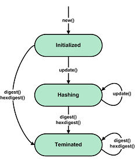

API of the 'gostcrypto.gosthash' module
=======================================

Introduction
""""""""""""

The module that implements the 'Streebog' hash calculation algorithm in accordance with GOST 34.11-2012 with a hash size of 512 bits and 256 bits.  The module includes the ``GOST34112012`` class, the ``GOSTHashError`` class and ``new`` function.

.. note::
    You can hash only **byte strings** or **byte arrays** (for example ``b'hash_text'`` or ``bytearray([0x68, 0x61, 0x73, 0x68, 0x5f, 0x74, 0x65, 0x78, 0x74])``).

API principles
""""""""""""""

    Generic state diagram for a hash object

The first message fragment for a hash can be passed to the ``new()`` function with the ``data`` parameter after specifying the name of the hashing algorithm (``'streebog256'`` or ``'streebog512'`` ):

.. code-block:: python

    import gostcrypto
	
	hash_string = u'Се ветри, Стрибожи внуци, веютъ с моря стрелами на храбрыя плъкы Игоревы'.encode('cp1251')
	hash_obj = gostrypto.gosthash.new('streebog256', data=hash_string)

The ``data`` argument is optional and may be not passed to the ``new`` function. In this case, the ``data`` parameter must be passed in the ``update()`` method, which is called after ``new()``:

.. code-block:: python

    import gostcrypto
	
	hash_string = u'Се ветри, Стрибожи внуци, веютъ с моря стрелами на храбрыя плъкы Игоревы'.encode('cp1251')
	hash_obj = gostrypto.gosthash.new('streebog256')
	hash_obj.update(hash_string)

After that, the ``update`` method can be called any number of times as needed, with other parts of the message

Passing the first part of the message to the ``new ()`` function, and the subsequent parts to the ``update()`` method:

.. code-block:: python

    import gostcrypto
	
	hash_obj = gostcrypto.gosthash.new('streebog512', data=b'first part message')
	hash_obj.update(b'second part message')
	hash_obj.update(b'third part message')

Passing the first part of the message and subsequent parts to the ``update()`` method:

.. code-block:: python

    import gostcrypto
	
	hash_obj = gostcrypto.gosthash.new('streebog512')
	hash_obj.update(b'first part message')
	hash_obj.update(b'second part message')
	hash_obj.update(b'third part message')

Hash calculation is completed using the ``digest()`` or ``hexdigest()`` method:

.. code-block:: python

    import gostcrypto
	
	hash_obj = gostcrypto.gosthash.new('streebog512')
	hash_obj.update(b'first part message')
	hash_obj.update(b'second part message')
	hash_obj.update(b'third part message')
	hash_result = hash_obj.digest()

Functions
"""""""""

new(name, \**kwargs)
''''''''''''''''''''
    Creates a new hashing object and returns it.

.. code-block:: python

    import gostcrypto
	
	hash_string = u'Се ветри, Стрибожи внуци, веютъ с моря стрелами на храбрыя плъкы Игоревы'.encode('cp1251')
	hash_obj = gostrypto.gosthash.new('streebog256', data=hash_string)

.. rubric:: **Arguments:**

- **name** - the string with the name of the hashing algorithm ``'streebog256'`` for the GOST R 34.11-2012 algorithm with the resulting hash length of 32 bytes or ``'streebog512'`` with the resulting hash length of 64 bytes.

.. rubric:: **Keyword arguments:**

- **data** - the data from which to get the hash (as a byte object). If this argument is passed to a function, you can immediately use the ``digest()`` (or ``hexdigest()``) method to calculate the hash value after calling ``new()``. If the argument is not passed to the function, then you must use the ``update()`` method before the ``digest()`` (or ``hexdigest()``) method.

.. rubric:: **Return:**

- New hashing object (as an instance of the ``GOST34112012`` class).

.. rubric:: **Exceptions:**

- GOSTHashError('unsupported hash type') - in case of invalid value ``name``.

*****

Classes
"""""""

GOST34112012
''''''''''''
    Class that implements the hash calculation algorithm GOST 34.11-2012 ('Streebog').
	
Methods:
--------

update(data)
~~~~~~~~~~~~
    Update the hash object with the bytes-like object.

.. code-block:: python

    import gostcrypto

    hash_obj = gostcrypto.gosthash.new('streebog256')
    hash_string = u'Се ветри, Стрибожи внуци, веютъ с моря стрелами на храбрыя плъкы Игоревы'.encode('cp1251')
    hash_obj.update(hash_string)

.. rubric:: **Arguments:**

- **data** - the string from which to get the hash. Repeated calls are equivalent to a single call with the concatenation of all the arguments: ``m.update(a)``; ``m.update(b)`` is equivalent to ``m.update(a+b)``.

*****

digest()
~~~~~~~~
    Returns the digest of the data passed to the ``update()`` method so far. This is a bytes object of size ``digest_size``.

.. code-block:: python

    import gostcrypto

    hash_obj = gostcrypto.gosthash.new('streebog256')
    hash_string = u'Се ветри, Стрибожи внуци, веютъ с моря стрелами на храбрыя плъкы Игоревы'.encode('cp1251')
    hash_obj.update(hash_string)
    result = hash_obj.digest()

.. rubric:: **Return:**

- The digest value (as a byte object).

*****

hexdigest()
~~~~~~~~~~~
    Returns the hexadecimal digest of the data passed to the ``update()`` method so far. This is a double-sized string object (``digest_size * 2``).

.. code-block:: python

    import gostcrypto

    hash_obj = gostcrypto.gosthash.new('streebog256')
    hash_string = u'Се ветри, Стрибожи внуци, веютъ с моря стрелами на храбрыя плъкы Игоревы'.encode('cp1251')
    hash_obj.update(hash_string)
    result = hash_obj.hexdigest()

.. rubric:: **Return:**

- The digest value (as a hexadecimal string).

*****

reset()
~~~~~~~
    Resets the values of all class attributes.

.. code-block:: python

    import gostcrypto

    hash_obj = gostcrypto.gosthash.new('streebog256')
    hash_string_1 = u'Се ветри, Стрибожи внуци, веютъ с моря стрелами на храбрыя плъкы Игоревы'.encode('cp1251')
    hash_string_2 = bytearray([
        0x30, 0x31, 0x32, 0x33, 0x34, 0x35, 0x36, 0x37, 0x38, 0x39, 0x30, 0x31, 0x32, 0x33, 0x34, 0x35,
        0x36, 0x37, 0x38, 0x39, 0x30, 0x31, 0x32, 0x33, 0x34, 0x35, 0x36, 0x37, 0x38, 0x39, 0x30, 0x31,
        0x32, 0x33, 0x34, 0x35, 0x36, 0x37, 0x38, 0x39, 0x30, 0x31, 0x32, 0x33, 0x34, 0x35, 0x36, 0x37,
        0x38, 0x39, 0x30, 0x31, 0x32, 0x33, 0x34, 0x35, 0x36, 0x37, 0x38, 0x39, 0x30, 0x31, 0x32,
    ])

    hash_obj.update(hash_string_1)
    result_1 = hash_obj.digest()
    hash_obj.reset()
    hash_obj.update(hash_string_2)
    result_2 = hash_obj.digest()

*****

copy()
~~~~~~
    Returns a copy ("clone") of the hash object. This can be used to efficiently compute the digests of data sharing a common initial substring.

.. code-block:: python

    import gostcrypto

    hash_obj_1 = gostcrypto.gosthash.new('streebog256')
    hash_obj_2 = hash_obj_1.copy()

*****

Attributes:
-----------

digest_size
~~~~~~~~~~~
    An integer value the size of the resulting hash in bytes. For the ``'streebog256'`` algorithm, this value is 32, for the ``'streebog512'`` algorithm, this value is 64.

.. code-block:: python

    import gostcrypto

    hash_obj = gostcrypto.gosthash.new('streebog256')
    hash_obj_digest_size = hash_obj.digest_size

*****

block_size
~~~~~~~~~~
    An integer value the internal block size of the hash algorithm in bytes. For the ``'streebog256'`` algorithm and the ``'streebog512'`` algorithm, this value is 64.

.. code-block:: python

    import gostcrypto

    hash_obj = gostcrypto.gosthash.new('streebog256')
    hash_obj_block_size = hash_obj.block_size

*****

name
~~~~
    A text string value the name of the hashing algorithm. Respectively ``'streebog256'`` or ``'streebog512'``.

.. code-block:: python

    import gostcrypto

    hash_obj = gostcrypto.gosthash.new('streebog256')
    hash_obj_name = hash_obj.name

*****

oid
~~~
    An instance of the ``ObjectIdentifier`` class that contains information about the identifier of the hash algorithm object. For more information, see: :doc:`API of the 'gostcrypto.gostoid' module <../gostoid/gostoid>`.

.. note:: For the '**streebog256**' hashing algorithm, the OID is ``'1.2.643.7.1.1.2.2'``, and the OID name is ``'id-tc26-gost3411-12-256'``. For the '**streebog512**' hashing algorithm, the OID is ``'1.2.643.7.1.1.2.3'``, and the OID name is ``'id-tc26-gost3411-12-512'``. 

*****

GOSTHashError
'''''''''''''
    The class that implements exceptions.

.. code-block:: python

    import gostcrypto

    hash_string = u'Се ветри, Стрибожи внуци, веютъ с моря стрелами на храбрыя плъкы Игоревы'.encode('cp1251')
    try:
        hash_obj = gostcrypto.gosthash.new('streebog256')
        hash_obj.update(hash_string)
    except gostcrypto.gosthash.GOSTHashError as err:
        print(err)
    else:
        result = hash_obj.digest()

Exception types:

- ``unsupported hash type`` - in case of invalid value ``name``.
- ``invalid data value`` - in case where the data is not byte object.

*****

Example of use
""""""""""""""

Getting a hash for a string
'''''''''''''''''''''''''''

.. code-block:: python

    import gostcrypto

    hash_string = u'Се ветри, Стрибожи внуци, веютъ с моря стрелами на храбрыя плъкы Игоревы'.encode('cp1251')
    hash_obj = gostcrypto.gosthash.new('streebog256', data=hash_string))
    hash_result = hash_obj.hexdigest()

Getting a hash for a file
'''''''''''''''''''''''''

In this case the 'buffer_size' value must be a multiple of the 'block_size' value.

.. code-block:: python

    import gostcrypto

    file_path = 'hash_file.txt'
    buffer_size = 128
    hash_obj = gostcrypto.gosthash.new('streebog512')
    with open(file_path, 'rb') as file:
        buffer = file.read(buffer_size)
        while len(buffer) > 0:
            hash_obj.update(buffer)
            buffer = file.read(buffer_size)
    hash_result = hash_obj.hexdigest()
