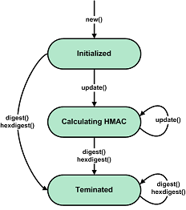

API of the 'gostcrypto.gosthmac' module
=======================================

Introductoon
""""""""""""

The module implementing the calculating the hash-based message authentication code (HMAC) in accordance with R 50.1.113-2016. The module includes the ``R5011132016`` and ``GOSTHMACError`` classes and the ``new`` function.

API principles
""""""""""""""

    Generic state diagram for a HMAC object

The first message fragment for a HMAC can be passed to the ``new()`` function with the ``data`` parameter after specifying the name of the HMAC algorithm (``'HMAC_GOSTR3411_2012_256'`` or ``'HMAC_GOSTR3411_2012_512'`` ) and after specifying key value:

.. code-block:: python

    import gostcrypto

    key = bytearray.fromhex('000102030405060708090a0b0c0d0e0f101112131415161718191a1b1c1d1e1f')	
    hmac_string = bytearray.fromhex('0126bdb87800af214341456563780100')

    hmac_obj = gostrypto.gosthmac.new('HMAC_GOSTR3411_2012_256', key, data=hmac_string)

The ``data`` argument is optional and may be not passed to the ``new`` function. In this case, the ``data`` parameter must be passed in the ``update()`` method, which is called after ``new()``:

.. code-block:: python

    import gostcrypto

    key = bytearray.fromhex('000102030405060708090a0b0c0d0e0f101112131415161718191a1b1c1d1e1f')	
    hmac_string = bytearray.fromhex('0126bdb87800af214341456563780100')

    hmac_obj = gostrypto.gosthmac.new('HMAC_GOSTR3411_2012_256', key)
    hmac_obj.update(hmac_string)

After that, the ``update`` method can be called any number of times as needed, with other parts of the message

Passing the first part of the message to the ``new ()`` function, and the subsequent parts to the ``update()`` method:

.. code-block:: python

    import gostcrypto

    key = bytearray.fromhex('000102030405060708090a0b0c0d0e0f101112131415161718191a1b1c1d1e1f')
	
    hmac_obj = gostcrypto.gosthmac.new('HMAC_GOSTR3411_2012_256', key, data=b'first part message')
    hmac_obj.update(b'second part message')
    hmac_obj.update(b'third part message')

Passing the first part of the message and subsequent parts to the ``update()`` method:

.. code-block:: python

    import gostcrypto

    key = bytearray.fromhex('000102030405060708090a0b0c0d0e0f101112131415161718191a1b1c1d1e1f')

    hmac_obj = gostcrypto.gosthmac.new('HMAC_GOSTR3411_2012_256', key)
    hmac_obj.update(b'first part message')
    hmac_obj.update(b'second part message')
    hmac_obj.update(b'third part message')

HMAC calculation is completed using the ``digest()`` or ``hexdigest()`` method:

.. code-block:: python

    import gostcrypto
	
	key = bytearray.fromhex('000102030405060708090a0b0c0d0e0f101112131415161718191a1b1c1d1e1f')

    hmac_obj = gostcrypto.gosthmac.new('HMAC_GOSTR3411_2012_256', key)
    hmac_obj.update(b'first part message')
    hmac_obj.update(b'second part message')
    hmac_obj.update(b'third part message')
    hmac_result = hmac_obj.digest()

Functions
"""""""""

new(name, key, \**kwargs)
'''''''''''''''''''''''''
    Creates a new authentication code calculation object and returns it.

.. code-block:: python

    import gostcrypto

    key = bytearray.fromhex('000102030405060708090a0b0c0d0e0f101112131415161718191a1b1c1d1e1f')
    hmac_string = bytearray.fromhex('0126bdb87800af214341456563780100')

    hmac_obj = gostcrypto.gosthmac.new('HMAC_GOSTR3411_2012_256', key, data=hmac_string)

.. rubric:: **Arguments:**

- **name** - name of the authentication code calculation mode ('HMAC_GOSTR3411_2012_256' or 'HMAC_GOSTR3411_2012_512').
- **key** - authentication key (as a byte object between 32 and 64 bytes in size).

.. rubric:: **Keyword arguments:**

- **data** - the data from which to get the HMAC (as a byte object).  If this argument is passed to a function, you can immediately use the ``digest()``
    (or ``hexdigest()``) method to calculate the HMAC value after calling ``new()``. If the argument is not passed to the function, then you must use the``update()`` method before the ``digest()`` (or ``hexdigest()``) method.

.. rubric:: **Return:**

- New authentication code calculation object object (as an instance of the R5011132016 class).

.. rubric:: **Exceptions:**

- GOSTHMACError('unsupported mode') - in case of unsupported mode.
- GOSTHMACError('invalid key value') - in case of invalid key value.
- GOSTHMACError('invalid data value'): in case where the data is not byte object.

*****

Classes
"""""""

R5011132016
'''''''''''

Methods:
--------

update(data)
~~~~~~~~~~~~
    Update the HMAC object with the bytes-like object.

.. code-block:: python

    import gostcrypto

    key = bytearray.fromhex('000102030405060708090a0b0c0d0e0f101112131415161718191a1b1c1d1e1f')
    data = bytearray.fromhex('0126bdb87800af214341456563780100')

    hmac_obj = gostcrypto.gosthmac.new('HMAC_GOSTR3411_2012_256', key)
    hmac_obj.update(data)

.. rubric:: **Arguments:**

- **data** - the message for which want to calculate the authentication code. Repeated calls are equivalent to a single call with the concatenation of all the arguments: ``m.update(a)``; ``m.update(b)`` is equivalent to ``m.update(a+b)``.

.. rubric:: **Exceptions:**

- GOSTHMACError('invalid data value'): in case where the data is not byte object.

*****

digest()
~~~~~~~~
    Returns the HMAC message authentication code.

.. code-block:: python

    import gostcrypto

    key = bytearray.fromhex('000102030405060708090a0b0c0d0e0f101112131415161718191a1b1c1d1e1f')
    data = bytearray.fromhex('0126bdb87800af214341456563780100')

    hmac_obj = gostcrypto.gosthmac.new('HMAC_GOSTR3411_2012_256', key)
    hmac_obj.update(data)
    hmac_result = hmac_obj.digest()

.. rubric:: **Return:**

- The HMAC message authentication code (as a byte object).

*****

hexdigest()
~~~~~~~~~~~
    Returns the HMAC message authentication code as a hexadecimal string.

.. code-block:: python

    import gostcrypto

    key = bytearray.fromhex('000102030405060708090a0b0c0d0e0f101112131415161718191a1b1c1d1e1f')
    data = bytearray.fromhex('0126bdb87800af214341456563780100')

    hmac_obj = gostcrypto.gosthmac.new('HMAC_GOSTR3411_2012_256', key)
    hmac_obj.update(data)
    hmac_result = hmac_obj.hexdigest()

.. rubric:: **Return:**

- The HMAC message authentication code (as a hexadecimal string).

*****

copy()
~~~~~~
    Returns a copy (“clone”) of the HMAC object. This can be used to efficiently compute the digests of data sharing a common initial substring.

.. code-block:: python

    import gostcrypto

    key = bytearray.fromhex('000102030405060708090a0b0c0d0e0f101112131415161718191a1b1c1d1e1f')

    hmac_obj_1 = gostcrypto.gosthmac.new('HMAC_GOSTR3411_2012_256', key)
    hmac_obj_2 = hmac_obj.copy()

.. rubric:: **Return:**

- The copy (“clone”) of the HMAC object.

*****

reset()
~~~~~~~
    Resets the values of all class attributes.

.. code-block:: python

    import gostcrypto

    key = bytearray.fromhex('000102030405060708090a0b0c0d0e0f101112131415161718191a1b1c1d1e1f')
    data_1 = bytearray.fromhex('0126bdb87800af214341456563780100')
    data_2 = bytearray.fromhex('43414565637801000126bdb87800af21')
    	
    hmac_obj = gostcrypto.gosthmac.new('HMAC_GOSTR3411_2012_256', key)
    hmac_obj.update(data_1)
    hmac_result_1 = hmac_obj.hexdigest()
    hmac_obj.reset()
    hmac_obj.update(data_2)
    hmac_result_2 = hmac_obj.hexdigest()

*****

clear()
~~~~~~~
    Сlears the key value.

.. code-block:: python

    import gostcrypto

    key = bytearray.fromhex('000102030405060708090a0b0c0d0e0f101112131415161718191a1b1c1d1e1f')

    hmac_obj = gostcrypto.gosthmac.new('HMAC_GOSTR3411_2012_256', key)
    hmac_obj.clear()

*****

Attributes:
-----------

digest_size
~~~~~~~~~~~
    An integer value of the size of the resulting HMAC digest in bytes.

.. code-block:: python

    import gostcrypto

    key = bytearray.fromhex('000102030405060708090a0b0c0d0e0f101112131415161718191a1b1c1d1e1f')

    hmac_obj = gostcrypto.gosthmac.new('HMAC_GOSTR3411_2012_256', key)
    digest_size = hmac_obj.digest_size

*****

block_size
~~~~~~~~~~~
    An integer value the internal block size of the hash algorithm in bytes.

.. code-block:: python

    import gostcrypto

    key = bytearray.fromhex('000102030405060708090a0b0c0d0e0f101112131415161718191a1b1c1d1e1f')

    hmac_obj = gostcrypto.gosthmac.new('HMAC_GOSTR3411_2012_256', key)
    block_size = hmac_obj.block_size
	
*****

name
~~~~
    A text string is the name of the authentication code calculation algorithm (``'HMAC_GOSTR3411_2012_256'`` or ``'HMAC_GOSTR3411_2012_512'``).

.. code-block:: python

    import gostcrypto

    key = bytearray.fromhex('000102030405060708090a0b0c0d0e0f101112131415161718191a1b1c1d1e1f')

    hmac_obj = gostcrypto.gosthmac.new('HMAC_GOSTR3411_2012_256', key)
    hmac_name = hmac_obj.name

*****

oid
~~~
    An instance of the ``ObjectIdentifier`` class that contains information about the identifier of the HMAC algorithm object. For more information, see: :doc:`API of the 'gostcrypto.gostoid' module <../gostoid/gostoid>`.

.. note:: For the '**HMAC_GOSTR3411_2012_256**' HMAC algorithm, the OID is ``'1.2.643.7.1.1.4.1'``, and the OID name is ``'id-tc26-hmac-gost-3411-12-256'``. For the '**HMAC_GOSTR3411_2012_512**' HMAC algorithm, the OID is ``'1.2.643.7.1.1.4.2'``, and the OID name is ``'id-tc26-hmac-gost-3411-12-512'``. 

*****

GOSTHMACError
'''''''''''''
    The class that implements exceptions.

.. code-block:: python

    import gostcrypto

    key = bytearray.fromhex('000102030405060708090a0b0c0d0e0f101112131415161718191a1b1c1d1e1f')
    data = bytearray.fromhex('0126bdb87800af214341456563780100')

    try:
        hmac_obj = gostcrypto.gosthmac.new('HMAC_GOSTR3411_2012_256', key)
        hmac_obj.update(data)
    except gostcrypto.gosthmac.GOSTHMACError as err:
        print(err)
    else:
        hmac_result = hmac_obj.digest()

Exception types:

- ``unsupported mode`` - in case of unsupported mode.
- ``invalid key value`` - in case of invalid key value.
- ``invalid data value`` - in case where the data is not byte object.

Example of use
""""""""""""""

Getting a HMAC for a string
'''''''''''''''''''''''''''

.. code-block:: python

    import gostcrypto

    key = bytearray.fromhex('000102030405060708090a0b0c0d0e0f1011121315161718191a1b1c1d1e1f')
    data = bytearray.fromhex('0126bdb87800af214341456563780100')

    hmac_obj = gostcrypto.gosthmac.new('HMAC_GOSTR3411_2012_256', key, data=data)
    hmac_result = hmac_obj.digest()

Getting a HMAC for a file
'''''''''''''''''''''''''

In this case the ``buffer_size`` value must be a multiple of the ``block_size`` value.

.. code-block:: python

    import gostcrypto

    key = bytearray.fromhex('000102030405060708090a0b0c0d0e0f1011121315161718191a1b1c1d1e1f')
    data = bytearray.fromhex('0126bdb87800af214341456563780100')

    hmac_obj = gostcrypto.gosthmac.new('HMAC_GOSTR3411_2012_256', key, data=data)
    hmac_result = hmac_obj.digest()
